# AgentHub - Architecture Diagrams

This document provides visual representations of the AgentHub system architecture.

## Table of Contents
- [High-Level System Architecture](#high-level-system-architecture)
- [Component Interaction Diagram](#component-interaction-diagram)
- [Data Flow Diagram](#data-flow-diagram)
- [Agent Execution Flow](#agent-execution-flow)
- [Security Layers](#security-layers)

---

## High-Level System Architecture


---

## Component Interaction Diagram


---

## Data Flow Diagram


---

## Agent Execution Flow


---

## Security Layers


---

## Agent Isolation Architecture

```mermaid
graph LR
    subgraph FinanceAgent["Finance Agent"]
        FA_CONFIG[Config]
        FA_MODEL[GPT-4]
        FA_TOOLS[Finance MCP]
        FA_DATA[(finances.db)]
    end

    subgraph ResearchAgent["Research Agent"]
        RA_CONFIG[Config]
        RA_MODEL[Claude]
        RA_TOOLS[Web Search]
        RA_DATA[(research.db)]
    end

    subgraph PersonalAgent["Personal Agent"]
        PA_CONFIG[Config]
        PA_MODEL[Llama 3]
        PA_TOOLS[Notion Personal]
        PA_DATA[(personal.db)]
    end

    subgraph WorkAgent["Work Agent"]
        WA_CONFIG[Config]
        WA_MODEL[GPT-4]
        WA_TOOLS[Notion Work<br/>Slack]
        WA_DATA[(work.db)]
    end

    ORCHESTRATOR[Agent Orchestrator] --> FinanceAgent
    ORCHESTRATOR --> ResearchAgent
    ORCHESTRATOR --> PersonalAgent
    ORCHESTRATOR --> WorkAgent

    FA_DATA -.X.-|Isolated| RA_DATA
    RA_DATA -.X.-|Isolated| PA_DATA
    PA_DATA -.X.-|Isolated| WA_DATA
    WA_DATA -.X.-|Isolated| FA_DATA

    style FinanceAgent fill:#c8e6c9
    style ResearchAgent fill:#bbdefb
    style PersonalAgent fill:#f8bbd0
    style WorkAgent fill:#ffe0b2
```

---

## File Structure and Git Safety

```mermaid
graph TD
    ROOT[AgentHub Repository]

    ROOT --> SAFE[Safe to Commit ✅]
    ROOT --> UNSAFE[Never Commit ❌]

    SAFE --> AGENTS[agents/*.yml]
    SAFE --> MCPS[mcp/*.yml]
    SAFE --> CONFIG[config/*.yml]
    SAFE --> CODE[src/]
    SAFE --> DOCS[docs/]

    UNSAFE --> ENV[.env]
    UNSAFE --> DATA[data/]
    UNSAFE --> DBS[*.db files]
    UNSAFE --> LOGS[logs/]
    UNSAFE --> CACHE[cache/]

    AGENTS -.->|References| ENV
    MCPS -.->|References| ENV

    style SAFE fill:#c8e6c9
    style UNSAFE fill:#ffcdd2
    style ROOT fill:#e3f2fd
```



---

## Deployment Architecture

```mermaid
graph TB
    subgraph Local["💻 Local Development"]
        DEV_UI[Web UI<br/>localhost:3000]
        DEV_API[Backend<br/>localhost:8000]
        DEV_DB[(SQLite)]
    end

    subgraph Docker["🐳 Docker Compose"]
        DC_NGINX[Nginx]
        DC_BACKEND[Backend Container]
        DC_DB[(PostgreSQL)]
        DC_REDIS[(Redis)]

        DC_NGINX --> DC_BACKEND
        DC_BACKEND --> DC_DB
        DC_BACKEND --> DC_REDIS
    end

    subgraph K8s["☸️ Kubernetes"]
        INGRESS[Ingress]
        SVC_FE[Frontend Service]
        SVC_BE[Backend Service]
        PODS[Backend Pods<br/>Auto-scaling]
        PG[(PostgreSQL<br/>StatefulSet)]
        PV[Persistent Volumes<br/>for data/]

        INGRESS --> SVC_FE
        INGRESS --> SVC_BE
        SVC_BE --> PODS
        PODS --> PG
        PODS --> PV
    end

    style Local fill:#e1f5ff
    style Docker fill:#fff4e1
    style K8s fill:#e8f5e9
```



---

## Technology Stack


---

## Summary

AgentHub's architecture is designed with three core principles:

1. **🔒 Security First**: Secrets never in Git, data scope isolation, runtime-only secret resolution
2. **🎯 Modularity**: Clean separation of concerns, easy to extend and customize
3. **🚀 Scalability**: Start simple (SQLite), scale when needed (PostgreSQL + K8s)

For detailed component specifications, see [Component Specs](./plan/03-component-specs.md).

For security details, see [Security Principles](./plan/05-security-principles.md).
