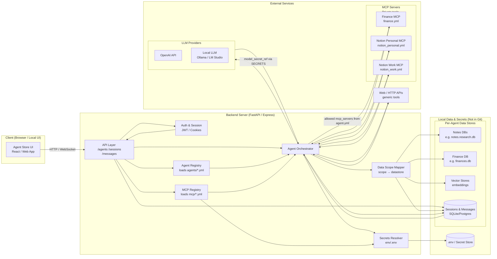

# AgentHub - System Architecture Overview

## High-Level Architecture

AgentHub follows a layered architecture with strict separation between configuration, orchestration, data, and execution.



## Layer Breakdown

### 1. Client Layer
**Purpose**: User interface for interacting with agents

**Components**:
- **Agent Store UI**: Web-based interface (React/Vue/Svelte)
  - Browse available agents
  - Start new chat sessions
  - View session history
  - Create/edit agents (future)

**Communication**: HTTP/WebSocket to Backend API

---

### 2. Backend/API Layer
**Purpose**: Core orchestration and business logic

**Components**:

#### API Layer
- REST endpoints for CRUD operations
- `/agents` - List, get, create agents
- `/sessions` - Manage chat sessions
- `/messages` - Send/receive messages
- WebSocket support for streaming responses

#### Auth & Session Manager
- User authentication (JWT/cookies)
- Session lifecycle management
- Permission checking (who can use which agent)

#### Agent Orchestrator (The Brain)
- Loads agent configuration from registry
- Resolves secrets via Secrets Resolver
- Attaches allowed MCP clients
- Enforces data scope restrictions
- Manages LLM conversation loop
- Executes tool calls
- Streams responses back to client

#### Agent Registry
- Loads all `agents/*.yml` files at startup
- Provides agent metadata to UI
- Validates agent configurations
- Hot-reload support (future)

#### MCP Registry
- Loads all `mcp/*.yml` files at startup
- Initializes MCP server connections
- Resolves MCP secrets via Secrets Resolver
- Provides tool catalog per MCP server

#### Secrets Resolver
- Reads `.env` file or secret store
- Resolves `${SECRET_NAME}` references
- Never exposes raw secrets to LLMs
- Injects secrets only during tool execution

#### Data Scope Mapper
- Maps logical scopes to physical datastores
- Example: `notes.research` → `/data/research.db`
- Enforces agent-level access control
- Provides filtered database connections to orchestrator

---

### 3. Data & Secrets Layer
**Purpose**: Persistent storage (never committed to Git)

**Components**:

#### `.env` / Secret Store
- API keys for LLM providers (OpenAI, Anthropic, etc.)
- API tokens for MCP servers (Notion, Slack, etc.)
- Database credentials (if using remote DBs)
- All secrets loaded via `dotenv` or similar

#### Per-Agent Data Stores
Isolated databases per logical scope:

**Notes DBs**:
- `research.db` - Research notes, papers, web clips
- `personal.db` - Personal journal, todos, ideas
- SQLite or embedded DB

**Finance DB**:
- `finances.db` - Budget, transactions, investments
- Sensitive financial data
- Could be encrypted at rest

**Vector Stores**:
- Embeddings for RAG (Retrieval-Augmented Generation)
- Per-agent vector collections
- ChromaDB, FAISS, or Qdrant

**Sessions & Messages**:
- Chat history per session
- SQLite for MVP, Postgres for scale
- Shared across all agents (filtered by agent_id)

---

### 4. External Services Layer
**Purpose**: LLM providers and external tools

**Components**:

#### LLM Providers
**Cloud**:
- OpenAI (GPT-4, GPT-3.5)
- Anthropic (Claude)
- Google (Gemini)

**Local**:
- Ollama (Llama 3, Mistral, etc.)
- LM Studio
- llama.cpp

#### MCP Servers (Private Tools)
Model Context Protocol servers provide tools to agents:

**Finance MCP** (`mcp/finance.yml`):
- Get account balances
- List transactions
- Budget tracking
- Investment portfolio

**Notion Personal MCP** (`mcp/notion_personal.yml`):
- Read/write personal workspace
- Create pages, update databases
- Search notes

**Notion Work MCP** (`mcp/notion_work.yml`):
- Read/write work workspace
- Separate credentials from personal

#### Generic Web/HTTP APIs
- Web search
- Wikipedia
- Weather APIs
- Any public REST API

---

## Key Architectural Decisions

### 1. YAML-Based Configuration
**Decision**: Use YAML files for agent and MCP configurations

**Rationale**:
- Human-readable and Git-friendly
- Easy to version control
- Simple for non-developers to understand
- Can be validated with JSON schemas

**Trade-off**: Manual editing required (mitigated by future UI)

### 2. Secret References, Not Secrets
**Decision**: Configs contain `secret_ref: "OPENAI_API_KEY"`, not actual keys

**Rationale**:
- Safe to commit to public repos
- Secrets resolved at runtime from `.env`
- Different secrets per environment (dev/prod)

**Trade-off**: Requires `.env` setup (documented in README)

### 3. Data Scope Isolation
**Decision**: Each agent explicitly declares allowed data scopes

**Rationale**:
- Prevents accidental data leakage between agents
- Clear boundary: finance agent can't read research notes
- Easier to audit and reason about data access

**Trade-off**: Manual scope configuration needed

### 4. MCP for External Tools
**Decision**: Use Model Context Protocol for tool integration

**Rationale**:
- Open standard from Anthropic
- Supports local and remote tools
- Growing ecosystem of MCP servers
- Better than custom tool implementations

**Trade-off**: Dependency on MCP spec (but it's open)

### 5. Backend-Centric Architecture
**Decision**: Heavy backend orchestration, thin client

**Rationale**:
- Secrets never touch the client
- Tool execution happens server-side
- Easier to audit and log
- Works with any client (web, CLI, mobile)

**Trade-off**: Client can't work offline

### 6. Single Backend Process (For Now)
**Decision**: Monolithic backend initially, not microservices

**Rationale**:
- Simpler deployment (single binary/process)
- Easier debugging
- Lower latency (no inter-service calls)
- Can split later if needed

**Trade-off**: Harder to scale horizontally (but not needed for MVP)

---

## Technology Stack Recommendations

### Backend
**Option 1: Python + FastAPI**
- Pros: Rich AI/ML ecosystem, async support, great docs
- Cons: Slower than Go/Rust for high concurrency
- Best for: Rapid development, Python-heavy teams

**Option 2: TypeScript + Express/Fastify**
- Pros: Same language as frontend, great for real-time (WebSockets)
- Cons: Less mature AI tooling than Python
- Best for: Full-stack JS teams

### Frontend
**React** or **Vue** or **Svelte**
- All are viable, choose based on team preference
- Focus on developer experience and UI libraries (Shadcn, Tailwind)

### Database
**SQLite** for MVP:
- Single file, no server needed
- Perfect for local-first
- Easy backup (just copy files)

**PostgreSQL** for scale:
- Better concurrency
- JSON support for flexible schemas
- Full-text search

### Vector Store
**ChromaDB** (embedded) or **Qdrant** (server)
- ChromaDB: Simpler, embedded like SQLite
- Qdrant: More features, better for scale

### LLM Integration
**LangChain** or **LlamaIndex** or **Direct API calls**
- LangChain: Comprehensive but heavy
- LlamaIndex: Better for RAG use cases
- Direct APIs: Simplest, most control

---

## Deployment Model

### Local Development
```
$ git clone https://github.com/you/agenthub
$ cd agenthub
$ cp .env.example .env    # Add your API keys
$ npm install             # or pip install
$ npm run dev             # Start backend + frontend
$ open http://localhost:3000
```

### Self-Hosted Production
**Docker Compose**:
- Backend container
- Frontend container (Nginx)
- PostgreSQL container (optional)
- Volume mounts for `data/` and `.env`

**Single Binary** (Go/Rust backend):
- Embed frontend as static assets
- Single executable + `.env` + `data/`
- Easy to distribute

---

## Security Architecture

### Threat Model
**What we protect against**:
- Secrets leaking into Git commits
- Agent A accessing Agent B's data
- LLMs seeing raw API keys
- Unauthorized users running agents

**What we don't (yet) protect against**:
- Malicious agents (trust your agent configs)
- Compromised backend (secure your host)
- Side-channel attacks (out of scope for MVP)

### Security Layers

1. **Git Safety**: Secrets in `.env` (gitignored), not in YAML configs
2. **Data Isolation**: Orchestrator enforces scope restrictions
3. **Secret Injection**: Secrets resolved at runtime, never sent to LLM
4. **Auth & Permissions**: Only authorized users can run agents
5. **Audit Logging**: All tool calls logged (future)

---

## Scalability Considerations

### MVP Scale
- 1-10 users
- 10-50 agents
- 100s of sessions
- 1000s of messages

**Bottlenecks**:
- SQLite lock contention (use WAL mode)
- Single process for orchestrator (fine for MVP)

### Growth Scale
- 100s of users
- 100s of agents
- 1000s of concurrent sessions

**Solutions**:
- Migrate to PostgreSQL
- Add Redis for session state
- Load balancer + multiple backend instances
- Separate orchestrator workers

### Enterprise Scale
- 1000s of users
- Multi-tenancy
- High availability

**Solutions**:
- Kubernetes deployment
- Distributed vector store (Weaviate, Pinecone)
- Separate services (API, Orchestrator, Workers)
- Database sharding

**Note**: We optimize for single-user/small-team first, scale later.
