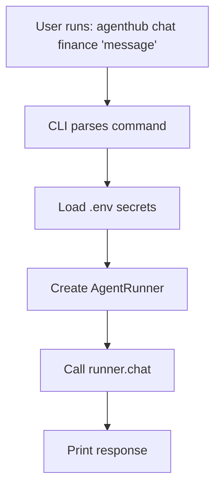
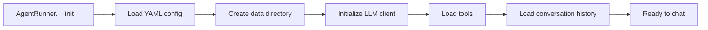
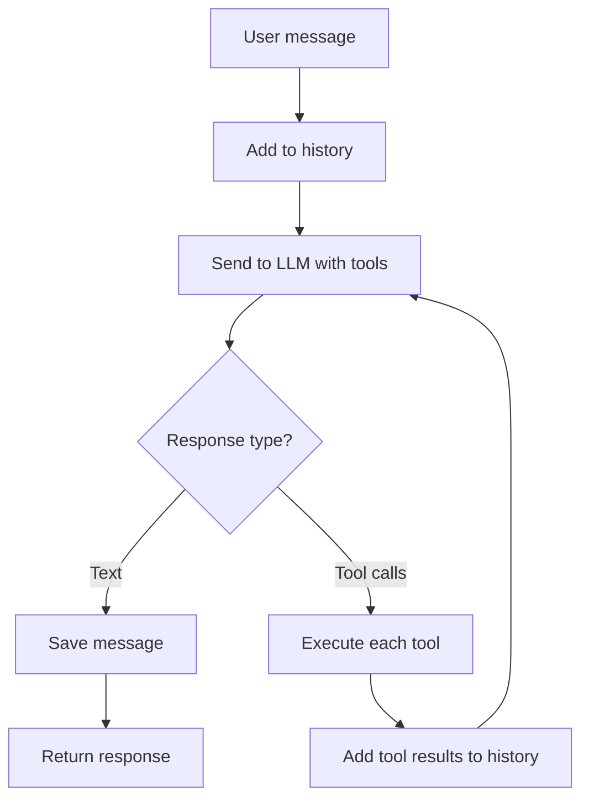
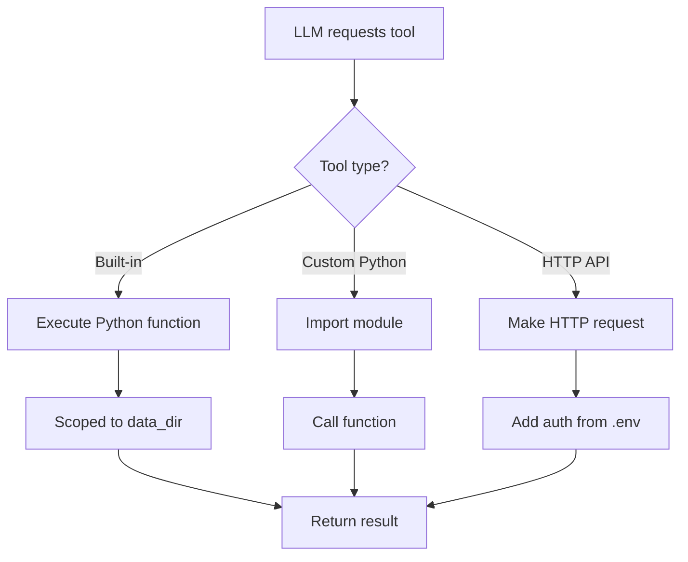
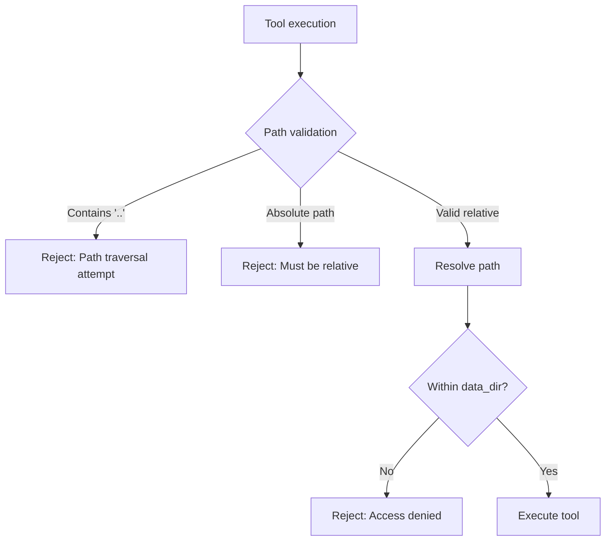
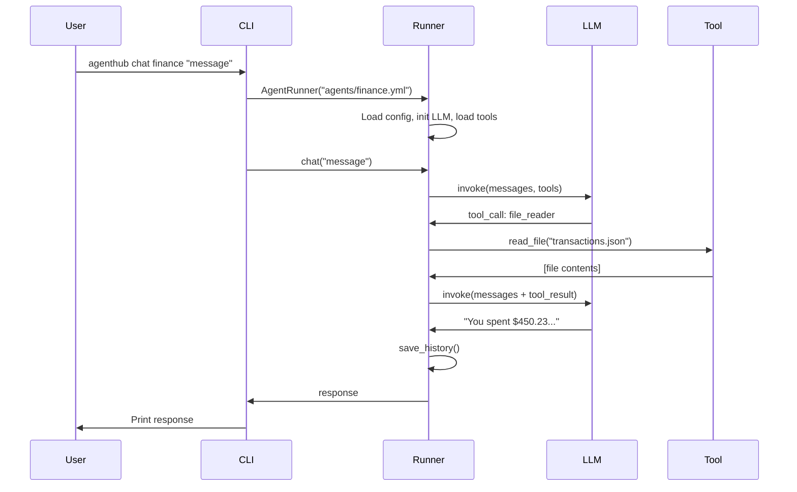
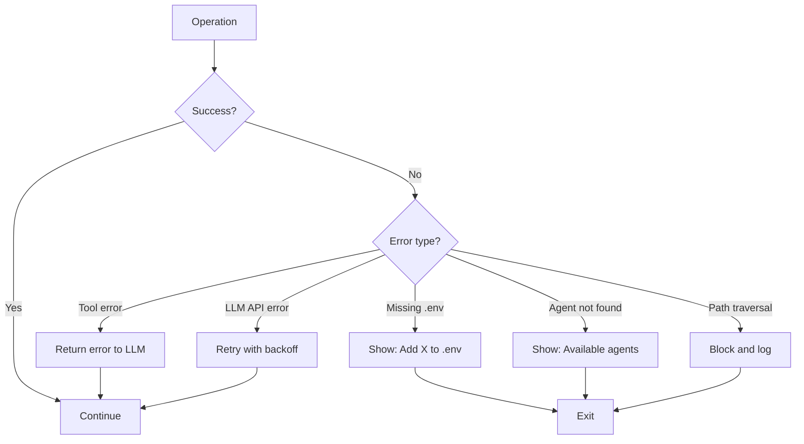

# AgentHub - Execution Flow (Simplified)

## Overview

AgentHub's execution is **dead simple**:
1. User runs command
2. Load agent config
3. Initialize LLM
4. Run conversation loop
5. Execute tools if needed
6. Return response

No complex orchestration. No registries. Just straightforward Python.

---

## 1. CLI Command Execution



**Code:**
```python
# User command
$ agenthub chat finance "How much did I spend?"

# CLI execution
def cmd_chat(args):
    agent_id = args[0]
    message = " ".join(args[1:])

    runner = AgentRunner(f"agents/{agent_id}.yml")
    response = runner.chat(message)
    print(response)
```

---

## 2. AgentRunner Initialization



**Code:**
```python
def __init__(self, agent_config_path: str):
    # 1. Load config
    self.config = yaml.safe_load(open(agent_config_path))

    # 2. Create data directory
    self.data_dir = Path(self.config['data_dir'])
    self.data_dir.mkdir(parents=True, exist_ok=True)

    # 3. Initialize LLM
    if self.config['model']['provider'] == 'ollama':
        self.llm = Ollama(model=self.config['model']['model'])
    elif self.config['model']['provider'] == 'openai':
        api_key = os.getenv(self.config['model']['api_key_env'])
        self.llm = OpenAI(api_key=api_key, model=self.config['model']['model'])

    # 4. Load tools
    self.tools = self._load_tools()

    # 5. Load history
    self.messages = self._load_history()
```

---

## 3. Conversation Loop



**Code:**
```python
def chat(self, user_message: str) -> str:
    # Add user message
    self.messages.append({"role": "user", "content": user_message})

    # Conversation loop
    for i in range(10):  # Max 10 iterations
        # Call LLM
        response = self.llm.invoke(self.messages, tools=self.tools)

        # Text response = done
        if response.content:
            self.messages.append({"role": "assistant", "content": response.content})
            self._save_history()
            return response.content

        # Tool calls = execute and continue
        if response.tool_calls:
            for tool_call in response.tool_calls:
                result = self._execute_tool(tool_call)
                self.messages.append({
                    "role": "tool",
                    "tool_call_id": tool_call.id,
                    "content": result
                })
            continue

    return "Error: Max iterations reached"
```

---

## 4. Tool Execution



**Example: File Read Tool**
```python
# LLM calls: file_reader("transactions.json")

def _execute_tool(self, tool_call):
    tool_name = tool_call.name
    tool_args = tool_call.args

    if tool_name == "file_reader":
        path = self.data_dir / tool_args["path"]

        # Security: Validate path is within data_dir
        if ".." in str(path):
            return "Error: Invalid path"

        return path.read_text()
```

---

## 5. Data Isolation Enforcement



**Code:**
```python
def read_file(self, path: str) -> str:
    full_path = self.data_dir / path

    # Prevent directory traversal
    if ".." in str(path) or Path(path).is_absolute():
        raise ValueError("Invalid path")

    # Ensure within data_dir
    try:
        full_path.resolve().relative_to(self.data_dir.resolve())
    except ValueError:
        raise PermissionError("Access denied: path outside data_dir")

    return full_path.read_text()
```

---

## 6. End-to-End Example

**Scenario:** User asks finance agent about spending

```bash
$ agenthub chat finance "How much did I spend on groceries?"
```

**Step-by-step execution:**

```
1. CLI parses command
   - agent_id = "finance"
   - message = "How much did I spend on groceries?"

2. Load environment
   - dotenv.load_dotenv()

3. Create AgentRunner
   - Load agents/finance.yml
   - data_dir = data/finance/
   - Initialize Ollama(model="llama3")
   - Load tools: [calculator, file_reader, file_writer]
   - Load history from data/finance/.history.json

4. Call runner.chat(message)
   - Add user message to history

5. Send to LLM
   Request:
   {
     "messages": [
       {"role": "system", "content": "You are a finance assistant..."},
       {"role": "user", "content": "How much did I spend on groceries?"}
     ],
     "tools": [calculator, file_reader, file_writer]
   }

6. LLM responds with tool call
   Response:
   {
     "tool_calls": [{
       "name": "file_reader",
       "args": {"path": "transactions.json"}
     }]
   }

7. Execute tool
   - Read data/finance/transactions.json
   - Return contents

8. Add tool result to history
   {"role": "tool", "content": "[transactions JSON]"}

9. Send to LLM again
   Request includes tool result

10. LLM responds with text
    Response:
    {
      "content": "You spent $450.23 on groceries last month."
    }

11. Save history and return
    - Save to data/finance/.history.json
    - Print response to user
```

**Total execution time:** ~2-3 seconds

---

## 7. Sequence Diagram



---

## 8. Error Handling Flow



**Error handling code:**
```python
# Missing API key
try:
    api_key = os.getenv(api_key_env)
    if not api_key:
        raise ValueError(
            f"Missing {api_key_env} in .env file.\n"
            f"Add it to .env: {api_key_env}=your_key_here"
        )
except ValueError as e:
    print(f"Error: {e}")
    sys.exit(1)

# Tool execution error
try:
    result = tool_func(**args)
except Exception as e:
    # Return error to LLM so it can try something else
    result = f"Error: {str(e)}"
```

---

## 9. Performance Considerations

**Cold start:**
- Load config: <1ms
- Initialize LLM client: <100ms
- Load tools: <10ms
- Load history: <10ms
- **Total:** ~120ms

**Per message:**
- LLM call: 1-3s (depends on model)
- Tool execution: 10-500ms (depends on tool)
- Save history: <10ms

**Optimization opportunities (future):**
- Cache LLM client between calls
- Lazy load tools
- Use streaming responses
- Parallel tool execution

---

## Summary

| Step | Time | Can Fail? |
|------|------|-----------|
| Load config | <1ms | Yes (file not found) |
| Init LLM | ~100ms | Yes (missing API key) |
| Load tools | <10ms | Yes (invalid tool config) |
| Load history | <10ms | No (creates if missing) |
| LLM call | 1-3s | Yes (API error) |
| Tool execution | 10-500ms | Yes (tool error) |
| Save history | <10ms | No |

**Total typical execution:** 1-4 seconds per message.

**Key principle:** Keep it simple. No complex orchestration. Just straightforward function calls.
