# AgentHub - Execution Flow and Data Flow

## Overview

This document describes how data and requests flow through the AgentHub system, from user interaction to LLM response.

---

## 1. System Startup Flow

### On Application Start


### Startup Steps

1. **Load Environment**
   - Read `.env` file
   - Populate SecretsResolver

2. **Load Data Scopes**
   - Read `config/data_scopes.yml`
   - Map logical names to physical datastores

3. **Load Agent Configs**
   - Scan `agents/` directory for YAML files
   - Parse and validate each agent config
   - Verify all `secret_ref` values exist in `.env`
   - Build agent catalog

4. **Initialize MCP Servers**
   - Scan `mcp/` directory for YAML files
   - Resolve MCP authentication secrets
   - Establish connections (HTTP/stdio/SSE)
   - Load tool catalogs from each MCP

5. **Start API Server**
   - Initialize FastAPI/Express app
   - Set up routes
   - Start WebSocket server for streaming
   - Begin accepting requests

---

## 2. User Interaction Flow

### User Selects Agent and Sends Message


---

## 3. Agent Execution Flow (Core Loop)

### Full Message Processing Cycle


### Step-by-Step Breakdown

#### Step 1: Initialize Agent Context
```python
# Load agent configuration
agent_config = agent_registry.get(agent_id)

# Verify user permissions
if current_user not in agent_config.auth.allowed_users:
    raise PermissionError()

# Resolve LLM API key
api_key = secrets_resolver.get(agent_config.model.secret_ref)
```

#### Step 2: Set Up Tools
```python
tools = []

# Add built-in tools
if 'web_search' in agent_config.tools.builtin:
    tools.append(web_search_tool)

# Add MCP tools
for mcp_id in agent_config.tools.mcp_servers:
    mcp_client = mcp_registry.get(mcp_id)
    tools.extend(mcp_client.get_tools())
```

#### Step 3: Set Up Data Scopes
```python
data_connections = {}

for scope in agent_config.data_scopes:
    conn = data_scope_mapper.get_connection(scope)
    data_connections[scope] = conn
```

#### Step 4: Load Conversation History
```python
session = session_manager.get_session(session_id)
messages = session.get_messages(limit=50)  # Last 50 messages

# Add system prompt
messages.insert(0, {
    "role": "system",
    "content": agent_config.system_prompt
})

# Add new user message
messages.append({
    "role": "user",
    "content": user_message
})
```

#### Step 5: Conversation Loop
```python
while True:
    # Call LLM
    response = await llm_client.chat(
        messages=messages,
        tools=tools,
        temperature=agent_config.model.temperature
    )

    # Handle text response
    if response.type == "message":
        # Save to database
        session_manager.add_message(
            session_id=session_id,
            role="assistant",
            content=response.content
        )
        # Stream to user
        yield response.content
        break  # Done!

    # Handle tool calls
    if response.type == "tool_calls":
        for tool_call in response.tool_calls:
            # Validate scope access
            required_scope = tool_call.metadata.get("data_scope")
            if required_scope not in agent_config.data_scopes:
                result = {"error": "Permission denied: scope not allowed"}
            else:
                # Execute tool with scoped data access
                db = data_connections[required_scope]
                result = await tool_call.execute(db_connection=db)

            # Add tool result to conversation
            messages.append({
                "role": "tool",
                "tool_call_id": tool_call.id,
                "content": json.dumps(result)
            })

        # Continue loop to get final response
        continue
```

---

## 4. Tool Execution Flow

### MCP Tool Call Example

**Scenario**: User asks "How much did I spend on groceries last month?"

```mermaid
sequenceDiagram
    participant LLM
    participant Orchestrator
    participant MCPClient
    participant FinanceMCP
    participant FinanceDB

    LLM->>Orchestrator: Tool call: list_transactions<br/>{category: "groceries", period: "last_month"}

    Orchestrator->>Orchestrator: Check if agent has "finances" scope
    Note over Orchestrator: ✅ Agent has "finances" in data_scopes

    Orchestrator->>MCPClient: Execute list_transactions
    MCPClient->>FinanceMCP: HTTP POST /tools/list_transactions<br/>Headers: {Authorization: Bearer <token>}

    FinanceMCP->>FinanceDB: SELECT * FROM transactions<br/>WHERE category = 'groceries'<br/>AND date > '2024-12-01'
    FinanceDB-->>FinanceMCP: [transactions...]

    FinanceMCP->>FinanceMCP: Calculate total
    FinanceMCP-->>MCPClient: {total: 450.23, count: 28}

    MCPClient-->>Orchestrator: Tool result
    Orchestrator->>LLM: Add tool result to messages
    LLM-->>Orchestrator: "You spent $450.23 on groceries..."
```



### Security Checks During Tool Execution

1. **Scope Validation**
   ```python
   tool_scope = tool_call.metadata.get("data_scope")
   if tool_scope not in agent_config.data_scopes:
       return {"error": "Access denied"}
   ```

2. **Secret Injection**
   ```python
   # Secrets never sent to LLM
   # Resolved only during tool execution
   mcp_token = secrets_resolver.get(mcp_config.auth.secret_ref)
   headers = {"Authorization": f"Bearer {mcp_token}"}
   ```

3. **Result Sanitization**
   ```python
   # Remove sensitive fields before sending to LLM
   result = execute_tool(tool_call)
   sanitized = remove_keys(result, ["ssn", "account_number"])
   return sanitized
   ```

---

## 5. Data Scope Isolation Flow

### How Data Scopes Work

```
Agent Config:
  data_scopes: ["finances", "vector.finances"]

Available Databases:
  - finances.db          ← ✅ Allowed
  - research.db          ← ❌ Blocked
  - personal.db          ← ❌ Blocked
  - vector.finances/     ← ✅ Allowed
  - vector.research/     ← ❌ Blocked
```

### Enforcement at Runtime

```python
# During orchestrator initialization
allowed_connections = {}
for scope in agent_config.data_scopes:
    allowed_connections[scope] = data_scope_mapper.get_connection(scope)

# During tool execution
def execute_tool(tool_call, allowed_connections):
    required_scope = tool_call.get_required_scope()

    # Block if scope not allowed
    if required_scope not in allowed_connections:
        raise PermissionError(f"Agent does not have access to '{required_scope}'")

    # Execute with scoped connection
    db = allowed_connections[required_scope]
    result = tool_call.run(db)
    return result
```

---

## 6. Secret Resolution Flow

### How Secrets Are Resolved


### Code Example

```python
# Agent config (committed to Git)
model:
  secret_ref: "OPENAI_API_KEY"  # ← Reference only

# .env file (gitignored)
OPENAI_API_KEY=sk-proj-abc123...  # ← Actual secret

# Runtime resolution
class Orchestrator:
    def initialize_llm(self, agent_config):
        # Resolve secret at runtime
        api_key = self.secrets.get(agent_config.model.secret_ref)

        # Create LLM client with secret
        llm_client = OpenAI(api_key=api_key)

        # Secret NEVER sent to LLM in conversation
        # Only used for authentication
        return llm_client
```

---

## 7. Session and Message Flow

### Database Operations

```sql
-- Create new session
INSERT INTO sessions (id, agent_id, user_id)
VALUES ('sess_123', 'finance-assistant', 'user_456');

-- Add user message
INSERT INTO messages (id, session_id, role, content)
VALUES ('msg_1', 'sess_123', 'user', 'How much did I spend?');

-- Add assistant message
INSERT INTO messages (id, session_id, role, content)
VALUES ('msg_2', 'sess_123', 'assistant', 'You spent $450.23 on groceries last month.');

-- Load session history
SELECT role, content, created_at
FROM messages
WHERE session_id = 'sess_123'
ORDER BY created_at ASC
LIMIT 50;  -- Last 50 messages for context
```

### Memory Management

**Short-term memory**: Recent messages in session
```python
# Keep last N messages in context
recent_messages = session.get_messages(limit=50)
```

**Long-term memory**: Vector store for RAG
```python
# When agent has long_term_memory enabled
if agent_config.memory.long_term_enabled:
    # Search vector store for relevant past conversations
    relevant_docs = vector_store.search(
        query=user_message,
        collection=f"agent_{agent_id}_memory",
        limit=5
    )

    # Add to context
    context = "\n\n".join([doc.content for doc in relevant_docs])
    messages.insert(1, {
        "role": "system",
        "content": f"Relevant past context:\n{context}"
    })
```

---

## 8. Error Handling Flow

### Common Error Scenarios

#### 1. Secret Not Found
```python
try:
    api_key = secrets_resolver.get("MISSING_KEY")
except KeyError:
    return {
        "error": "Configuration error: MISSING_KEY not found in .env",
        "user_message": "This agent is not properly configured. Please contact support."
    }
```

#### 2. MCP Server Unavailable
```python
try:
    result = await mcp_client.call_tool(tool_call)
except ConnectionError:
    # Fallback: inform user gracefully
    return {
        "error": "Service temporarily unavailable",
        "user_message": "The finance service is currently unavailable. Please try again later."
    }
```

#### 3. Data Scope Permission Denied
```python
if required_scope not in agent_config.data_scopes:
    return {
        "error": f"Agent '{agent_id}' does not have access to scope '{required_scope}'",
        "user_message": "I don't have permission to access that data."
    }
```

#### 4. LLM API Rate Limit
```python
try:
    response = await llm_client.chat(messages)
except RateLimitError:
    # Exponential backoff retry
    await asyncio.sleep(2 ** retry_count)
    retry_count += 1
    # Retry up to 3 times
```

---

## 9. Streaming Response Flow

### Server-Sent Events (SSE)

```python
@app.post("/sessions/{session_id}/messages/stream")
async def stream_message(session_id: str, message: str):
    async def event_generator():
        orchestrator = Orchestrator(...)

        # Stream tokens as they come from LLM
        async for chunk in orchestrator.run_agent_streaming(session_id, message):
            yield {
                "event": "message",
                "data": json.dumps({"content": chunk})
            }

        # Signal completion
        yield {
            "event": "done",
            "data": json.dumps({"status": "completed"})
        }

    return StreamingResponse(
        event_generator(),
        media_type="text/event-stream"
    )
```

### WebSocket Alternative

```python
@app.websocket("/ws/sessions/{session_id}")
async def websocket_endpoint(websocket: WebSocket, session_id: str):
    await websocket.accept()

    while True:
        # Receive message from client
        data = await websocket.receive_json()
        user_message = data["message"]

        # Stream response
        async for chunk in orchestrator.run_agent_streaming(session_id, user_message):
            await websocket.send_json({
                "type": "chunk",
                "content": chunk
            })

        # Send completion signal
        await websocket.send_json({
            "type": "done"
        })
```

---

## 10. Complete End-to-End Example

### Scenario: User asks finance question

**Request**:
```
User: "How much did I spend on dining out last week?"
Agent: Finance Assistant
Session: sess_abc123
```

**Execution**:

1. ✅ Load agent config (`agents/finance-assistant.yml`)
2. ✅ Check user has permission to use Finance Assistant
3. ✅ Resolve OpenAI API key from `OPENAI_API_KEY`
4. ✅ Initialize MCP client for `finance_mcp` with token
5. ✅ Get data connection for `finances` scope → `finances.db`
6. ✅ Load last 50 messages from `sess_abc123`
7. ✅ Send to LLM with system prompt + history + new message
8. 🔧 LLM requests tool: `list_transactions(category="dining", start_date="2025-01-04")`
9. ✅ Validate: Finance Assistant has `finances` scope
10. ✅ Execute tool via Finance MCP → queries `finances.db`
11. ✅ Get results: `[{date: "2025-01-05", amount: 45.50, restaurant: "..."}]`
12. ✅ Send tool result back to LLM
13. ✅ LLM generates final response: "You spent $132.75 on dining out last week across 4 transactions."
14. ✅ Save assistant message to database
15. ✅ Stream response to user

**Total time**: ~2-3 seconds

---

This execution flow ensures security, isolation, and smooth user experience throughout the system.
