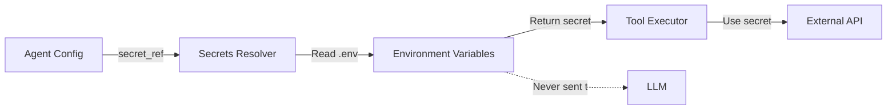

# AgentHub - Security and Isolation Principles

## Core Security Philosophy

AgentHub is built on the principle of **least privilege** and **defense in depth**. Each agent operates in a restricted environment with only the minimum permissions needed to function.

---

## 1. Git-Safe Architecture

### The Problem
How do you build an open-source AI system where:
- Configurations can be shared publicly
- Secrets remain private
- Private data never enters version control

### The Solution: Three-Layer Separation

```
Layer 1: Public Configuration (Safe to commit)
├── agents/*.yml        ← Agent definitions
├── mcp/*.yml           ← MCP server configs
└── config/*.yml        ← System settings

Layer 2: Local Secrets (Gitignored)
└── .env                ← API keys, tokens

Layer 3: Private Data (Gitignored)
└── data/
    ├── *.db            ← Databases
    ├── vectors/        ← Embeddings
    └── uploads/        ← User files
```

### Implementation

**.gitignore**:
```gitignore
# Secrets
.env
.env.*

# Private data
data/
*.db
vectors/

# Session state
sessions/
cache/

# Logs (may contain sensitive info)
logs/
*.log
```

**.env.example** (committed as template):
```bash
# LLM Provider API Keys
OPENAI_API_KEY=sk-your-key-here
ANTHROPIC_API_KEY=sk-ant-your-key-here

# MCP Server Tokens
NOTION_PERSONAL_TOKEN=secret_your-token-here
FINANCE_MCP_TOKEN=your-token-here
```

### Best Practices

1. **Never hardcode secrets**
   ```yaml
   # ❌ BAD
   model:
     api_key: sk-proj-abc123...

   # ✅ GOOD
   model:
     secret_ref: OPENAI_API_KEY
   ```

2. **Use descriptive secret references**
   ```yaml
   # ❌ BAD (ambiguous)
   secret_ref: API_KEY

   # ✅ GOOD (clear purpose)
   secret_ref: OPENAI_API_KEY_FINANCE_AGENT
   ```

3. **Document required secrets**
   - List all secrets in `.env.example`
   - Add comments explaining what each secret is for
   - Include links to where to get API keys

---

## 2. Data Scope Isolation

### The Problem
Without isolation, any agent could access all your data:
- Finance agent could read personal journal
- Research agent could access bank account data
- Work agent could see personal Notion workspace

### The Solution: Explicit Data Scopes

Each agent declares which data scopes it needs:

```yaml
# agents/finance-assistant.yml
data_scopes:
  - finances              # Can access finances.db
  - vector.finances       # Can search finance-related embeddings

# agents/research-assistant.yml
data_scopes:
  - notes.research        # Can access research.db only
  - vector.research       # Can search research embeddings
```

### Enforcement

**At Orchestrator Level**:
```python
class Orchestrator:
    def execute_tool(self, tool_call, agent_config):
        required_scope = tool_call.metadata.get("data_scope")

        # Validate scope access
        if required_scope not in agent_config.data_scopes:
            raise PermissionError(
                f"Agent '{agent_config.id}' attempted to access "
                f"'{required_scope}' but only has access to: "
                f"{agent_config.data_scopes}"
            )

        # Provide scoped connection
        db = self.data_scope_mapper.get_connection(required_scope)
        return tool_call.execute(db)
```

**At Database Level** (defense in depth):
```python
class DataScopeMapper:
    def get_connection(self, scope: str):
        # Only return connection if scope is valid
        if scope not in self.allowed_scopes:
            raise ValueError(f"Unknown scope: {scope}")

        # Return read-only connection for sensitive scopes
        if scope.startswith("finances"):
            return self.get_readonly_connection(scope)

        return self.get_connection(scope)
```

### Isolation Matrix

| Agent | finances.db | research.db | personal.db | work.db |
|-------|-------------|-------------|-------------|---------|
| Finance Assistant | ✅ Read/Write | ❌ | ❌ | ❌ |
| Research Assistant | ❌ | ✅ Read/Write | ❌ | ❌ |
| Personal Assistant | ❌ | ❌ | ✅ Read/Write | ❌ |
| Work Assistant | ❌ | ❌ | ❌ | ✅ Read/Write |

---

## 3. Secret Management

### The Problem
Secrets must be:
- Available to the system at runtime
- Never exposed to LLMs
- Never committed to Git
- Rotatable without code changes

### The Solution: Runtime Secret Resolution



### Implementation

**Secrets Resolver**:
```python
class SecretsResolver:
    def __init__(self, env_file: str = ".env"):
        load_dotenv(env_file)
        self.secrets = dict(os.environ)
        self._validate_required_secrets()

    def get(self, secret_ref: str) -> str:
        if secret_ref not in self.secrets:
            raise ValueError(
                f"Secret '{secret_ref}' not found in .env. "
                f"Please add it to your .env file."
            )
        return self.secrets[secret_ref]

    def _validate_required_secrets(self):
        # On startup, check all agent configs
        for agent in agent_registry.list():
            if not self.has(agent.model.secret_ref):
                logger.warning(
                    f"Agent '{agent.id}' requires secret "
                    f"'{agent.model.secret_ref}' which is missing"
                )
```

**Secret Injection (Only at API Call Time)**:
```python
# ❌ BAD: Sending secret to LLM
messages = [
    {"role": "system", "content": f"Use API key: {api_key}"}
]

# ✅ GOOD: Secret used only for authentication
llm_client = OpenAI(api_key=api_key)  # Secret in HTTP header
response = llm_client.chat(messages)  # No secret in messages
```

### Secret Rotation

When rotating secrets:
1. Update `.env` file with new secret
2. Restart AgentHub (hot-reload in future)
3. No code or config changes needed

---

## 4. MCP Server Isolation

### The Problem
Different agents need access to different external services:
- Personal Notion workspace vs Work Notion workspace
- Personal email vs Work email
- Different API keys per service

### The Solution: Per-Agent MCP Allowlist

**Agent Config**:
```yaml
# agents/personal-assistant.yml
tools:
  mcp_servers:
    - notion_personal      # Can use personal Notion
    - gmail_personal       # Can use personal email

# agents/work-assistant.yml
tools:
  mcp_servers:
    - notion_work          # Can use work Notion
    - slack_work           # Can use work Slack
```

**MCP Config**:
```yaml
# mcp/notion_personal.yml
id: notion_personal
connection:
  url: https://notion-mcp.local
  auth:
    secret_ref: NOTION_PERSONAL_TOKEN

# mcp/notion_work.yml
id: notion_work
connection:
  url: https://notion-mcp.local
  auth:
    secret_ref: NOTION_WORK_TOKEN    # Different token!
```

### Enforcement

```python
class Orchestrator:
    def get_tools_for_agent(self, agent_config):
        tools = []

        # Only attach MCPs that agent is allowed to use
        for mcp_id in agent_config.tools.mcp_servers:
            if mcp_id not in mcp_registry.list_ids():
                logger.warning(f"MCP '{mcp_id}' not found")
                continue

            mcp_client = mcp_registry.get(mcp_id)
            tools.extend(mcp_client.get_tools())

        return tools
```

**Result**: Personal assistant can't accidentally send work messages, and vice versa.

---

## 5. Authentication and Authorization

### User Authentication

**Session-based (MVP)**:
```python
# Simple cookie-based auth
@app.post("/login")
def login(username: str, password: str):
    user = authenticate(username, password)
    session_token = create_session(user.id)
    response.set_cookie("session", session_token, httponly=True)
    return {"status": "logged_in"}
```

**JWT-based (Production)**:
```python
@app.post("/login")
def login(username: str, password: str):
    user = authenticate(username, password)
    token = jwt.encode(
        {"user_id": user.id, "exp": datetime.utcnow() + timedelta(days=7)},
        secret=JWT_SECRET
    )
    return {"token": token}
```

### Agent Authorization

**Per-Agent Access Control**:
```yaml
# agents/finance-assistant.yml
auth:
  allowed_users:
    - "user@example.com"
    - "spouse@example.com"

# agents/work-assistant.yml
auth:
  allowed_users:
    - "*"  # All authenticated users
```

**Runtime Check**:
```python
def can_user_access_agent(user: User, agent_config: AgentConfig) -> bool:
    allowed = agent_config.auth.allowed_users

    # Wildcard: all users allowed
    if "*" in allowed:
        return True

    # Check specific user email
    if user.email in allowed:
        return True

    return False
```

---

## 6. Input Validation and Sanitization

### LLM Input Validation

**Prevent Prompt Injection**:
```python
def validate_user_input(message: str) -> str:
    # Check message length
    if len(message) > 10000:
        raise ValueError("Message too long")

    # Remove control characters
    message = "".join(char for char in message if char.isprintable() or char.isspace())

    # Optional: Detect prompt injection attempts
    if is_prompt_injection(message):
        logger.warning(f"Possible prompt injection detected: {message[:100]}")

    return message
```

### Tool Parameter Validation

**Schema Validation**:
```python
class ToolExecutor:
    def execute(self, tool_call: ToolCall):
        # Validate against tool schema
        tool_schema = self.get_tool_schema(tool_call.name)
        validate(tool_call.parameters, tool_schema)

        # Sanitize file paths
        if "path" in tool_call.parameters:
            tool_call.parameters["path"] = sanitize_path(
                tool_call.parameters["path"]
            )

        # Execute with validated parameters
        return tool_call.run()

def sanitize_path(path: str) -> str:
    # Prevent directory traversal
    path = os.path.normpath(path)
    if path.startswith("..") or path.startswith("/"):
        raise ValueError("Invalid path")
    return path
```

---

## 7. Audit Logging

### What to Log

**Security Events**:
```python
logger.security(
    event="agent_access_denied",
    user_id=user.id,
    agent_id=agent_id,
    reason="user not in allowed_users"
)

logger.security(
    event="data_scope_violation",
    agent_id=agent_id,
    attempted_scope="finances",
    allowed_scopes=agent_config.data_scopes
)
```

**Tool Calls**:
```python
logger.audit(
    event="tool_call",
    agent_id=agent_id,
    tool_name=tool_call.name,
    tool_parameters=sanitize_for_logging(tool_call.parameters),
    result_status="success",
    execution_time_ms=elapsed
)
```

**Data Access**:
```python
logger.audit(
    event="data_access",
    agent_id=agent_id,
    data_scope="finances",
    operation="read",
    table="transactions",
    row_count=25
)
```

### Log Storage

**Local Files** (development):
```
logs/
  security.log      ← Security events
  audit.log         ← Tool calls, data access
  error.log         ← Errors and exceptions
  access.log        ← HTTP requests
```

**Structured Logging** (production):
```json
{
  "timestamp": "2025-01-15T10:30:00Z",
  "level": "security",
  "event": "data_scope_violation",
  "agent_id": "finance-assistant",
  "user_id": "user_123",
  "attempted_scope": "research",
  "allowed_scopes": ["finances"],
  "session_id": "sess_456"
}
```

---

## 8. Rate Limiting and Resource Control

### Per-User Rate Limits

```python
from slowapi import Limiter
from slowapi.util import get_remote_address

limiter = Limiter(key_func=get_remote_address)

@app.post("/sessions/{session_id}/messages")
@limiter.limit("10/minute")  # Max 10 messages per minute
async def send_message(session_id: str, message: str):
    # ... handle message
```

### Per-Agent Resource Limits

```yaml
# agents/finance-assistant.yml
limits:
  max_tokens_per_response: 2000
  max_tool_calls_per_message: 5
  timeout_seconds: 30
```

**Enforcement**:
```python
class Orchestrator:
    async def run_agent(self, agent_config, message):
        tool_call_count = 0
        start_time = time.time()

        while True:
            # Check timeout
            if time.time() - start_time > agent_config.limits.timeout_seconds:
                raise TimeoutError("Agent execution timed out")

            response = await llm_client.chat(...)

            if response.type == "tool_calls":
                tool_call_count += len(response.tool_calls)

                # Check tool call limit
                if tool_call_count > agent_config.limits.max_tool_calls_per_message:
                    raise LimitExceeded("Too many tool calls")
```

---

## 9. Secure Defaults

### Principle of Least Privilege

**Default Agent Config** (most restrictive):
```yaml
data_scopes: []           # No data access by default
tools:
  builtin: []             # No built-in tools
  mcp_servers: []         # No MCP servers
auth:
  allowed_users: []       # No users (must be explicitly added)
```

**Explicit Opt-In Required**:
- Want web search? Must add `web_search` to `tools.builtin`
- Want data access? Must add scope to `data_scopes`
- Want users to access? Must add to `auth.allowed_users`

### Safe Tool Defaults

```python
class WebSearchTool:
    def __init__(self):
        # Rate limited by default
        self.rate_limiter = RateLimiter(max_calls=10, period=60)

        # Result size limited
        self.max_results = 5
        self.max_content_length = 5000

class FileReadTool:
    def __init__(self, data_scope: str):
        # Read-only by default
        self.mode = "readonly"

        # Size limited
        self.max_file_size = 10 * 1024 * 1024  # 10MB

        # Path restricted to data scope
        self.allowed_paths = [f"data/{data_scope}/"]
```

---

## 10. Threat Model and Mitigations

### Threats We Protect Against

| Threat | Mitigation |
|--------|------------|
| Secrets leaked in Git | Secrets stored in `.env` (gitignored) |
| Agent A accesses Agent B's data | Data scope isolation enforced by orchestrator |
| LLM sees API keys | Secrets resolved at runtime, never sent to LLM |
| Unauthorized user accesses agent | Auth check before agent execution |
| Prompt injection | Input validation and sanitization |
| Excessive API costs | Rate limiting and token limits |
| Data exfiltration via tools | Tool parameter validation, scope checks |
| Directory traversal | Path sanitization in file tools |

### Threats Outside Current Scope

| Threat | Why Out of Scope (for MVP) |
|--------|----------------------------|
| Malicious agent configs | Trust model: you write your own agents |
| Compromised backend server | Host security is infrastructure concern |
| Side-channel attacks | Requires specialized security hardening |
| Model poisoning | Trust model: you control your LLMs |
| DDoS attacks | Infrastructure/CDN concern |

---

## 11. Security Checklist

### For Developers

- [ ] Never commit `.env` files
- [ ] Always use `secret_ref` in configs, never hardcoded secrets
- [ ] Validate all user inputs
- [ ] Sanitize all tool parameters
- [ ] Log security events
- [ ] Use parameterized SQL queries (prevent SQL injection)
- [ ] Set appropriate CORS headers
- [ ] Use HTTPS in production

### For Users

- [ ] Use strong, unique passwords
- [ ] Rotate API keys regularly
- [ ] Review agent configs before use
- [ ] Monitor audit logs for suspicious activity
- [ ] Keep AgentHub updated
- [ ] Back up `.env` and `data/` securely
- [ ] Don't share `.env` file with anyone

### For Deployment

- [ ] Enable HTTPS (Let's Encrypt or similar)
- [ ] Set secure cookie flags (`httponly`, `secure`)
- [ ] Configure firewall rules (only expose necessary ports)
- [ ] Run backend as non-root user
- [ ] Enable disk encryption for `data/` folder
- [ ] Set up automated backups
- [ ] Monitor for security updates

---

This security model provides strong isolation while remaining practical for local, self-hosted deployments.
